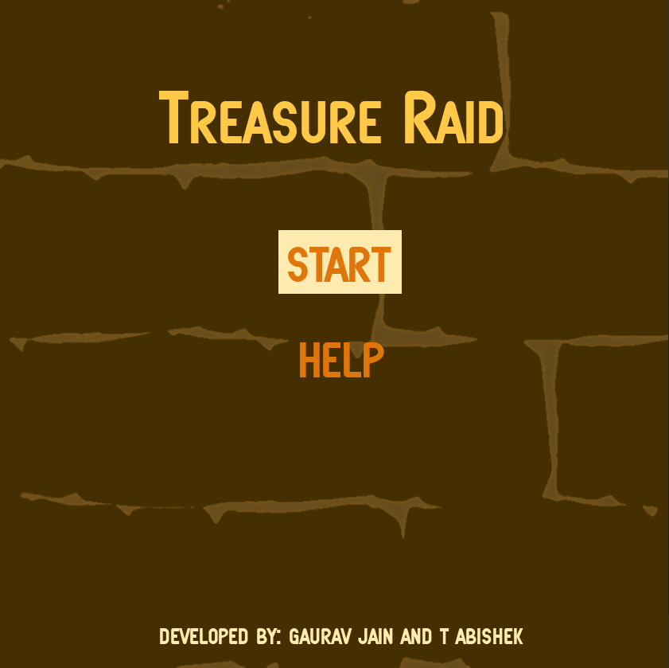
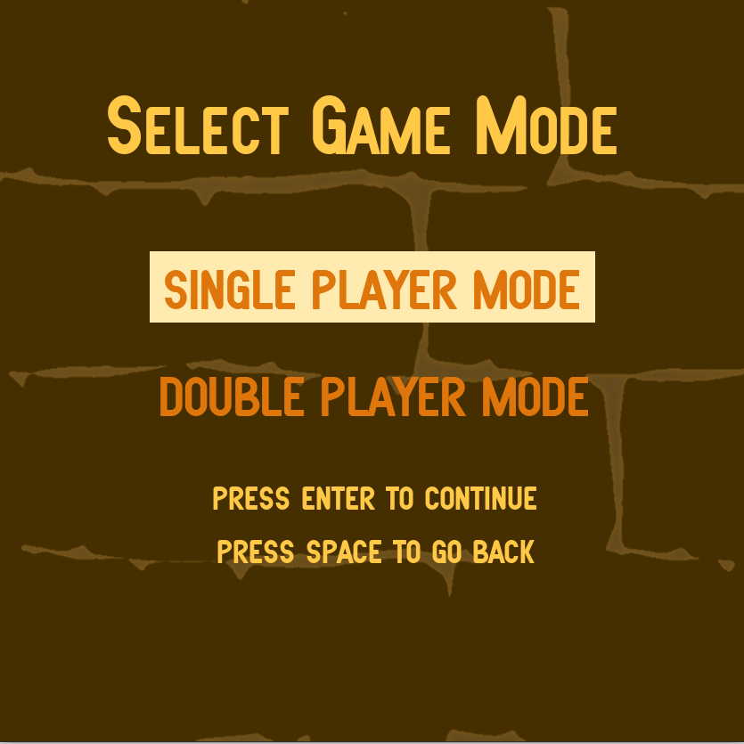
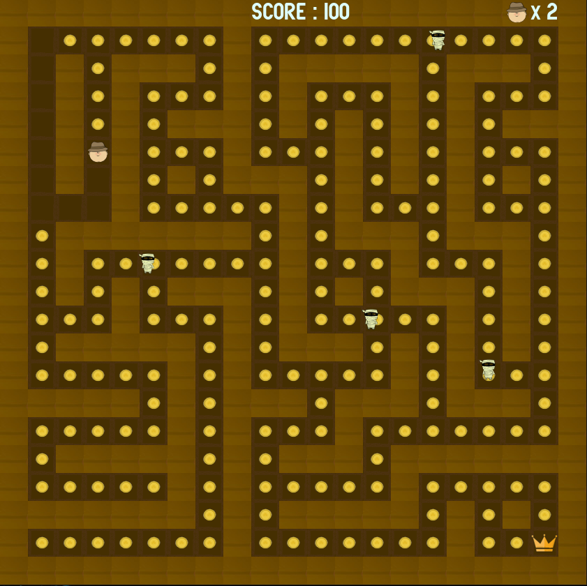
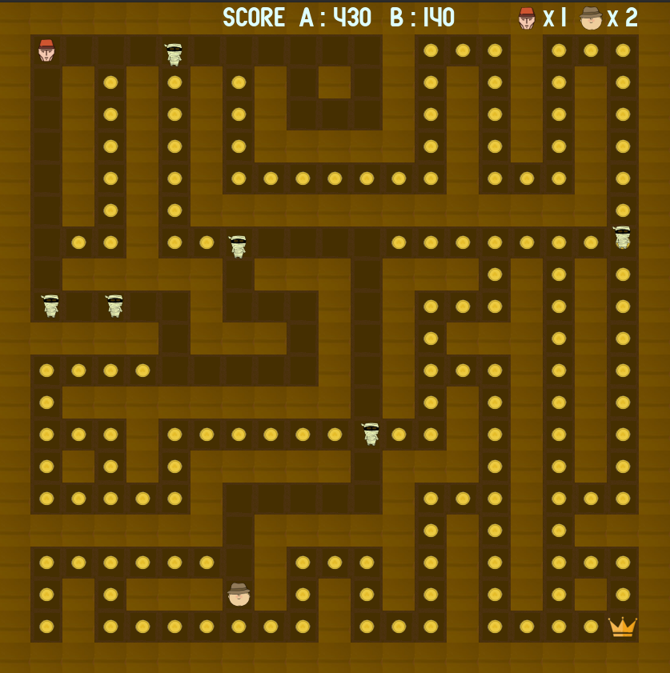
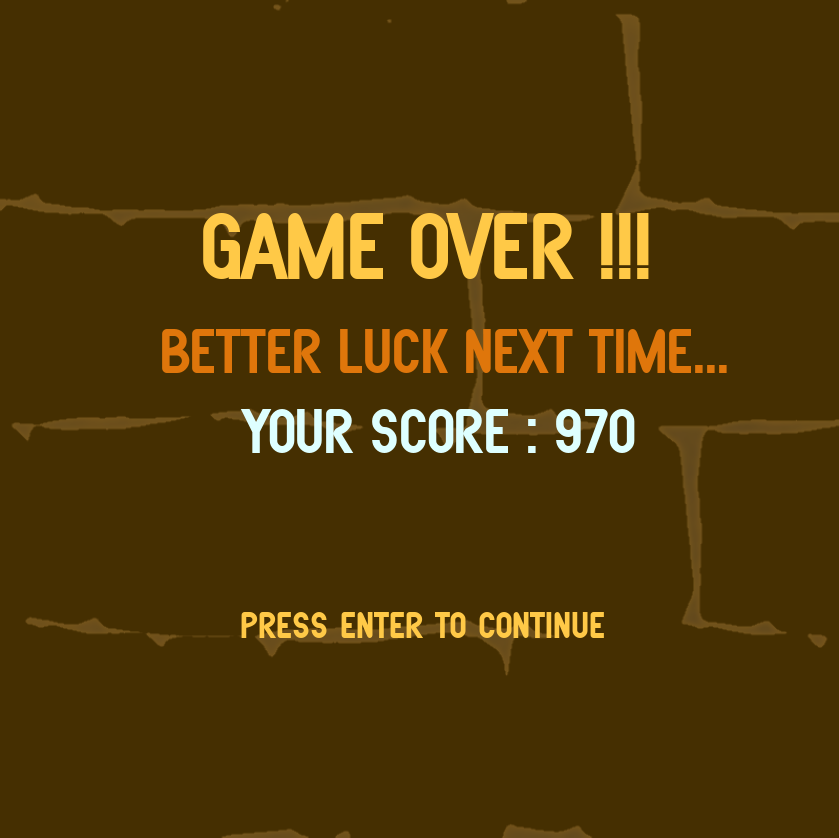

# COP290 Task 2: Treasure Raid Multiplayer Game
## About
This game is built for the first part of the second assignment of the course COP290 - Design Practices taught in IIT Delhi in II Sem, 2020-21

The game is built using SDL2 library and the game logic is written in C++. Networking is implementing ENet.
## How to play Treasure Raid?
1. Clone the repo.
2. Open server folder and run ```make```.
3. Open client folder and run ```make```.
4. Run ```./server``` in the server folder terminal and play the game either in offline single player or offline double player mode.
5. Run ```./client``` in the client folder terminal. This will connect the game to the localhost server running already. 


## Different screens of the Game







## What's Working
- [x] Game compiles and runs without crashing.
- [x] Offline single player/multiplayer mode is working.
- [x] Map generation uses randomly generated maze.
- [x] Online multiplayer game mode is tested in localhost.


Note:
1. Due to lack of public ip address, the game is not tested for internet hosting. The game works fine through loopback network (localhost).
2. The UDP sockets are able to recieve and send data to the server but there is a lag between the screens of server and client.

## Instructions to install SDL2 and other libraries
1. Run `sudo apt-get install libsdl2-dev` to install SDL2.
2. In order to run the game successfully, the following extra libraries are needed: SDL_image, SDL_ttf and SDL_mixer.

    - Install SDL_image using `sudo apt-get install libsdl2-image-dev`.

    - Install SDL_ttf using `sudo apt-get install libsdl2-ttf-dev`.
    - Install SDL_mixer using `sudo apt-get install libsdl2-mixer-dev`.

*The instructions mentioned above for various installations were used on Ubuntu 20.04.*

## References 
1.https://github.com/schuay/pacman
2.https://github.com/DarkMuffinJoe/Pacman
3.https://github.com/r6eve/pacman-sdl
4.https://en.wikipedia.org/wiki/User:Dllu/Maze
5.https://lazyfoo.net/tutorials/SDL/